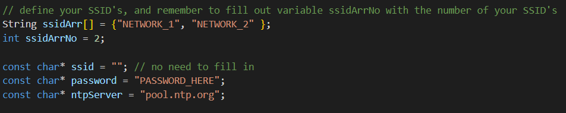
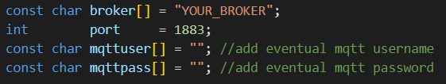

# Plant-Sensor
This Repo contains the code and technical data for the Plant Sensor.

## Setup

### IoT device
This project is based of of [pesor's TTGO-T-HIGrow project](https://github.com/pesor/TTGO-T-HIGrow) code. 
Before you can upload the code to your device you need to setup the config file located at include/user-variables.h.
You need to setup your network connection, broker connection and configure sensor data.

In order to configure the device to your needs, you need to set your network name/names instead of NETWORK_1 and NETWORK_2. the password should be put inside the `password` field. If you have more or less networks to connect to you must also change the `ssidArrNo` accordingly.

For the broker you need to insert your brokers adress and your port. The port usually is 1883.
If you are using a broker that requires credentials you can add them in the `mqttuser` and `mqttpass` field

For more info please visit [pesor's TTGO-T-HIGrow project setup guide](https://github.com/pesor/TTGO-T-HIGrow/wiki/05.-user-variables.h)

### Broker

### Open Remote
