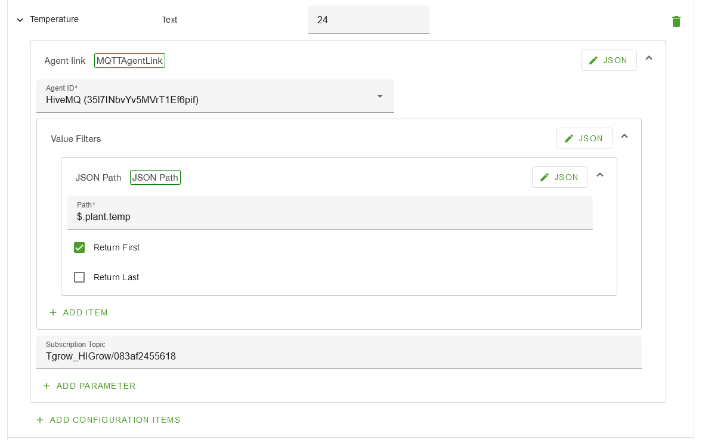

# Plant-Sensor
This Repo contains the code and technical data for the Plant Sensor.

# Setup
In this guide I am going to touch an the basic requirements and steps that have been and should be taken in order to get the sensor working and connected to Open remote.

## Prerequisites
First things first, what do you need? 
### Hardware
For the hardware you will need the following:

-   **TTGO-T-HIGrow.** *This device is the IoT device that will actually measure your plant. The TTGO-T-HIGrow will be used to detect the following: soil moisture, light, temperature and air moisture. that and the WIFI capabilities will be required for the device to function within this context  apart from the device being able to collect all the relative data, it also comes with a nice protective housing and battery.* 

### Software

-   **This repo.** *This repo contains the code for the IoT device. Included with that are a total of 4 libraries from external sources: Adafruit_BME280_Library, NTPClient, PubSubClient and Timelib.*
-   **[Docker](https://docs.docker.com/desktop/windows/install/).** *Docker is required to for the Open Remote instance to run.*
-   **[Open Remote](https://github.com/openremote/openremote/blob/master/README.md) instance (Docker).** *Open Remote is used to display sensor data.*
-   **[Visual Studio Code](https://code.visualstudio.com/) with [PlatformIO extension](https://platformio.org/install/ide?install=vscode).** *VSC is a code editor and PlatformIO is a extension that will help you run and monitor code for the IoT device.*
-   **[HiveMQ](https://www.hivemq.com/public-mqtt-broker/)(MQTT broker).** *free MQTT testing broker*

## IoT device
This project is based of of [Pesor's TTGO-T-HIGrow project](https://github.com/pesor/TTGO-T-HIGrow) code. Before you can start configuring, you need to make sure you have the right environment setup, for this you will need **Visual Studio Code** paired with the **PlatformIO extension**. The following video will give you a good idea how to set them both up. 

 

Before you can upload the code to your device you need to setup the config file located at include/user-variables.h.
You need to setup your network connection, broker connection and configure sensor data.
  

 
In order to configure the device to your needs, you need to set your network name/names instead of NETWORK_1 and NETWORK_2. the password should be put inside the `password` field. If you have more or less networks to connect to you must also change the `ssidArrNo` accordingly.
  

 
For the broker you need to insert your brokers address and your port. The port usually is 1883.
If you are using a broker that requires credentials you can add them in the `mqttuser` and `mqttpass` field.
if you choose to use the HiveMQ broker then the `broker` should be `broker.hivemq.com`
  

 
To calibrate the soil sensor.....
  

gather model number for topic

For more info please visit [Pesor's TTGO-T-HIGrow project setup guide](https://github.com/pesor/TTGO-T-HIGrow/wiki/05.-user-variables.h)

## Broker
### Using HiveMQ(no setup required)
HiveMQ is a free to use test broker on which anyone can pub and sub to any topic. The downside to this is that anyone with your sensors model name could theoretically listen in on all the data being send. But the upside is that it is free and requires no setup, meaning it's a nice place to start and test from.
|                   |                   |
|-------------------|-------------------|
| **Broker address** | broker.hivemq.com |
| **TCP port**      | 1883              |

### Using Mosquito
*Not yet done.*

## Open Remote

### Installing 
Open Remote's wiki page has a really good and comprehensive [quick start guide](https://github.com/openremote/openremote/blob/master/README.md) that will help you setup your staring OR environment.

### Configuring
First up on the todo list is to make ourselves a **agent**. An agent can be added via going to the asset tab and clicking the + icon
 
From the list of agents, you should pick **the MQTT Agent**. the agent can really be named anything you want it to be. I choose to name it after the broker I'm using, **HiveMQ**.
  

 
The agent needs to be configured to the broker you are using. In my case it will be the HiveMQ broker. You have to configure the **Host** and **port** fields to be the same as the broker you are using. The **Client id** field can be whatever you want, it will only be used for the broker to identify the connection from Open Remote to your broker.
  

 
The next thing you to add is the plant itself. from the asset list, you should select the **Thing Asset** and name it after your plant. this is going to be the central place for all your plant data.
  

 
After having added a plant you should add another **Thing Asset**. this one should have the **Name** field set to the sensor name(or whatever makes it easier for you) and the **Parent** field should be your previously added plant asset. this asset will directly act as one sensor. The reason for this setup is that you might want to add multiple sensors to your plant if you have a big pot/plant.
  

 
The simple way to set it up is to output the data from the IoT device as JSON. To do this you need to add a attribute, the name can be something like `data` or whatever you like . the type should be **JSON** or **JSON OBJECT**. After having added the attribute, you need to add a **agent link** configurational item. The **agent id** should be set to your MQTT broker agent. last but most importantly, you need to add a **subscription topic** parameter, put `Tgrow_HIGrow/`+`YOUR_MODEL_NUMBER_HERE`.

  

### Advanced config
The advanced config will allow you to setup a plant in such a way that you can use multiple sensors for one plant and get an average. It will also make the data better readable.
  
First thing you need to do is change your plant and sensor assets. Both assets need to have 4 individual sensor attributes each: temperature, soil_moisture, humidity, and light. 
The plant asset's attributes need to have a **rule state** configurational item.

 
for the sensor assets you need to change each individual attribute. Each attribute has a **agent link** with one **subscribe topic** and one **value filter** parameter. The **subscribe topic** should be setup like the previous one. The **value filter** should contain a **JSON PATH** with the path to the value relating to the attribute. you need to do this for each individual attribute in the sensor.
  

 
In to display the the general sum of all the sensors for a plant on the plant page, you need to setup some rules.
The image shows a rule for each attribute, its pretty simple and adds 2 sensors attribute value together and divides them by the amount of sensors. If you want to connect a single sensor to a single plant, you only need to connect the read attribute to the write attribute.
